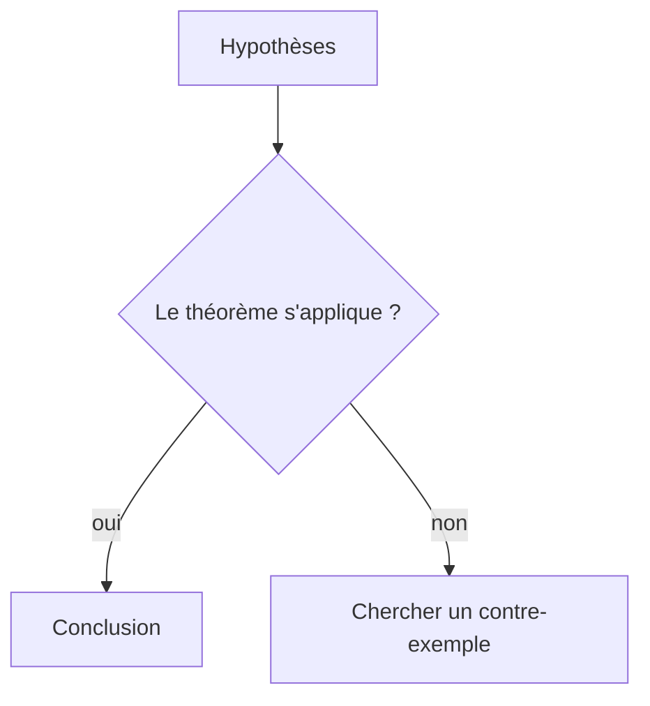
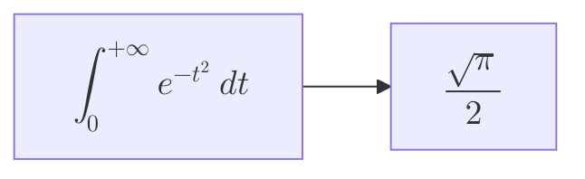
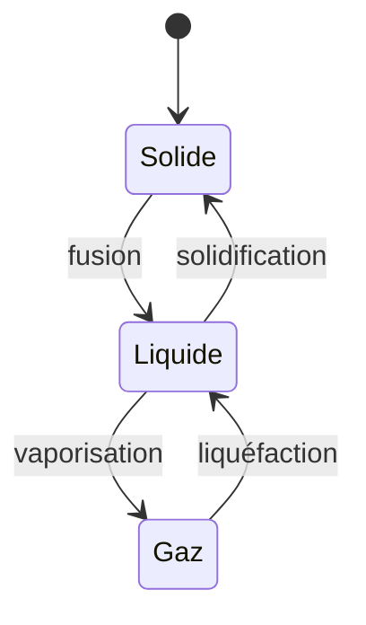

# Les diagrammes

AZprose compose vos **diagrammes** directement dans le document : organigrammes,
diagrammes de séquence, chronologies, cartes de notions… Vous les écrivez en
texte, l'application les dessine.

C'est la syntaxe **Mermaid**, un langage devenu courant : ce que vous écrivez ici
s'affiche à l'identique sur GitHub, dans de nombreux wikis et dans la plupart
des éditeurs Markdown.

## Écrire un diagramme

Ouvrez un bloc de code en indiquant `mermaid` comme langage :

````markdown

````

Le diagramme apparaît dans l'aperçu à la place du bloc — voici exactement ce
que produit le texte ci-dessus :


> [!tip] Tant que le diagramme n'est pas dessiné
> Le bloc affiche votre texte source. C'est normal : la bibliothèque de dessin
> se charge à la première utilisation, et seulement à ce moment-là — un
> document sans diagramme n'en paie jamais le coût.

## Les types disponibles

Les plus utiles pour un document scientifique :

| Mot-clé | Ce qu'il dessine |
|---|---|
| `flowchart` | organigramme, algorithme, arbre de décision |
| `sequenceDiagram` | échanges entre acteurs dans le temps |
| `stateDiagram-v2` | états et transitions |
| `classDiagram` | structures et relations d'héritage |
| `erDiagram` | entités et associations |
| `gantt` | planning, progression d'un chapitre |
| `mindmap` | carte de notions |
| `timeline` | chronologie |
| `xychart-beta` | courbes et histogrammes |

La liste complète et la syntaxe de chacun sont documentées sur le site de
Mermaid.

## Agrandir un diagramme

Un diagramme un peu dense devient vite illisible à la largeur du texte.
**Cliquez dessus** pour l'ouvrir en grand :

- **molette** — zoomer et dézoomer ;
- **glisser** — déplacer ;
- **`+`**, **`-`**, **`0`** — zoomer, dézoomer, revenir à la taille réelle ;
- **`Échap`** — fermer.

Le diagramme est aussi atteignable au clavier : `Tab` jusqu'à lui, puis
`Entrée`.

## Ils suivent votre document

Les diagrammes reprennent **la police et les couleurs de votre thème**. Changez
de thème, changez la police du document : ils se redessinent en accord. Rien à
régler.

À l'impression, ils passent en couleurs claires — le papier est blanc — et ne
sont jamais coupés entre deux pages.

## Quand la syntaxe est fautive

Un diagramme mal écrit **n'efface rien** : le bloc affiche le message d'erreur
et conserve votre texte, pour que vous puissiez le corriger. Le message indique
en général la ligne en cause.

## Des mathématiques dans un diagramme

Une formule écrite entre `$$` dans un libellé est composée **avec le même
moteur que le reste du document** — votre préambule et vos macros personnelles
comprises :



La **police mathématique** se choisit dans les réglages, module *MathJax* : *New
Computer Modern* (la police classique de TeX, celle par défaut) ou *Fira Math*,
sans sérif, qui s'accorde à un texte composé en Fira Sans. Le choix vaut pour
tout — texte, diagrammes, impression — et prend effet au redémarrage.

Trois points à connaître :

- **Une formule tient sur une seule ligne.** Les deux `$$` doivent se trouver
  sur la même ligne du bloc, sinon ils sont pris pour du texte ordinaire.
- **La taille du libellé s'ajuste à la formule** : un nœud portant une somme
  indexée est plus haut qu'un nœud portant un mot. C'est normal.
- **Une formule fautive n'emporte pas le diagramme** : le libellé affiche le
  message d'erreur du moteur mathématique, le reste est rendu normalement.

## Un second exemple, rendu



Son texte source tient en six lignes :

````markdown

````

Un diagramme reste du **texte** dans votre fichier : il se cherche, se
copie-colle, se compare d'une version à l'autre, et ne dépend d'aucun logiciel
de dessin.
